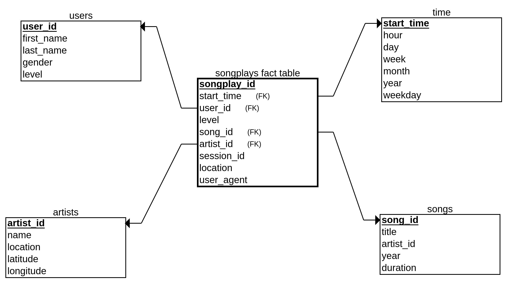

# Sparkify: Data Modeling with Postgres

## Project description
A startup called Sparkify wants to analyze the data they've been collecting on songs and user activity on their new music streaming app. The analytics team is particularly interested in understanding what songs users are listening to. Currently, they don't have an easy way to query their data, which resides in a directory of JSON logs on user activity on the app, as well as a directory with JSON metadata on the songs in their app.

**Project Goals**: 
- create a Postgres database with tables designed to optimize queries on song play analysis
- define fact and dimension tables for a star schema for a particular analytic focus
- write an ETL pipeline that transfers data from files in two local directories into these tables in Postgres using Python and SQL
## Project datasets:
- Song Dataset - this dataset is a subset of real data from the *Million Song Dataset*. Each file is in JSON format and contains metadata about a song and the artist of that song. The files are partitioned by the first three letters of each song's track ID.
- Log Dataset - this dataset consists of log files in JSON format generated by event simulator based on the songs in the dataset above. These simulate activity logs from a music streaming app based on specified configurations.
## Project files:
- test.ipynb: displays the first few rows of each table to let us check the database.
- create_tables.py: drops and creates tables. 
- etl.ipynb: reads and processes a single file from *song_data* and *log_data* and loads the data into your tables. 
- etl.py: reads and processes files from song_data and log_data and loads them into your tables
- sql_queries.py: contains all sql queries
- create_erm.py: creates database schema graph
- README.md: provides discussion on the project
## Database schema:
For this project I modeled a star schema that is optimized for queries on song play analysis. This includes the following tables:
#### Fact Table
1. songplays - records in log data associated with song plays i.e. records with page *NextSong*
 - songplay_id
 - start_time
 - user_id
 - level
 - song_id
 - artist_id
 - session_id
 - location
 - user_agent
#### Dimension Tables
2. users - users in the app
 - user_id
 - first_name
 - last_name
 - gender
 - level
3. songs - songs in music database
 - song_id
 - title
 - artist_id
 - year
 - duration
4. artists - artists in music database
 - artist_id
 - name
 - location
 - latitude
 - longitude
5. time - timestamps of records in *songplays* broken down into specific units
 - start_time
 - hour
 - day
 - week
 - month
 - year
 - weekday
 

## How to run Python Scripts:

- run *create_tables.py* that will create the database and tables
- run *etl.py* that will populate the database with the song play data in order to query the database
- after the database has been successfully created use the *test.ipynb* file to query the database

## References

- psycopg [documentation](https://www.psycopg.org/docs/)
- PostgreSQL [documentation](https://www.postgresql.org/docs/)
- [Udacity project description](https://www.udacity.com/)